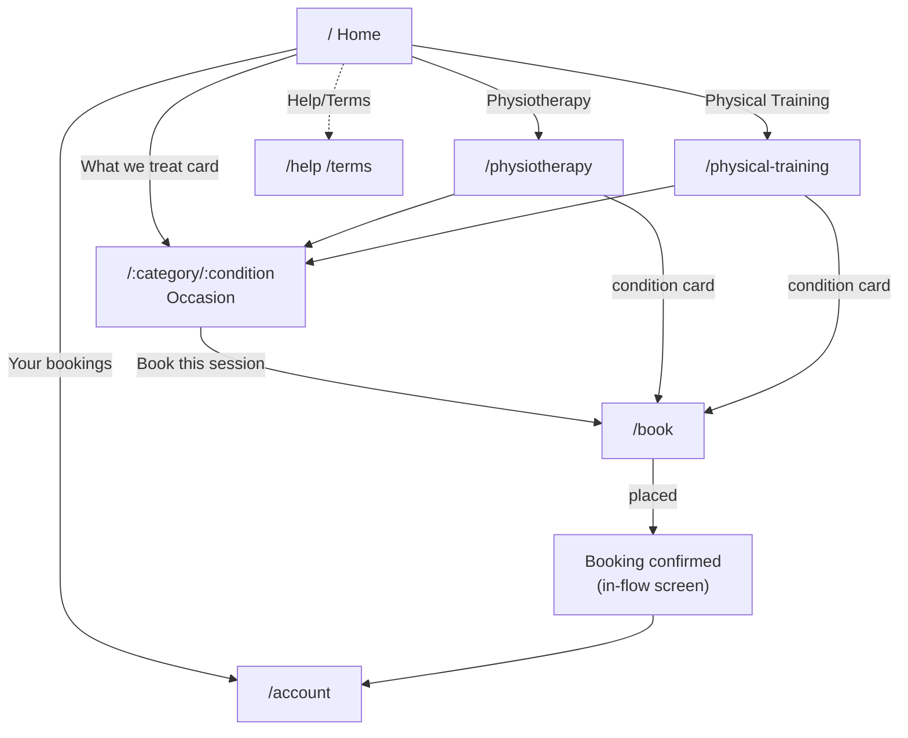
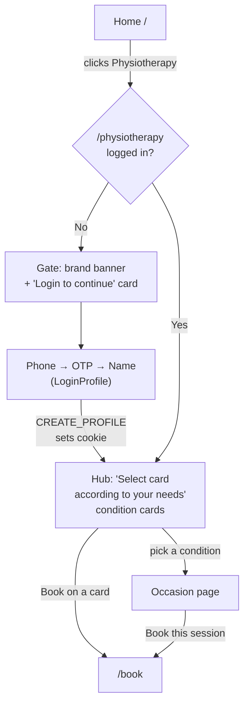
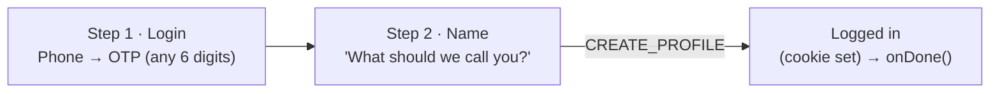
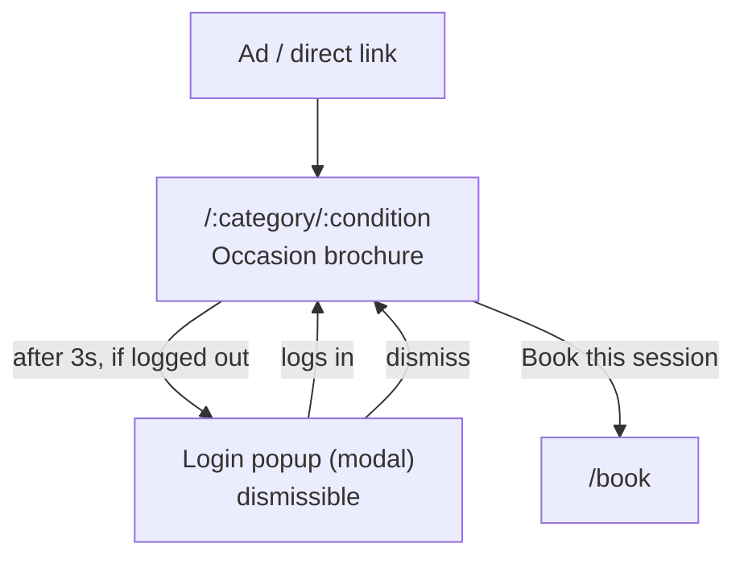
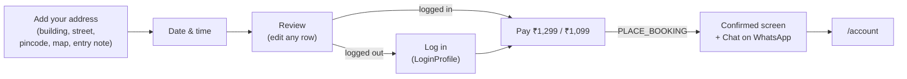
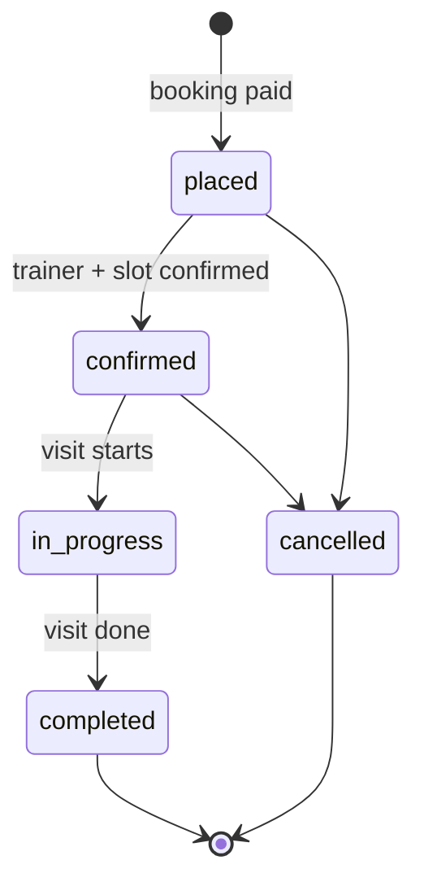
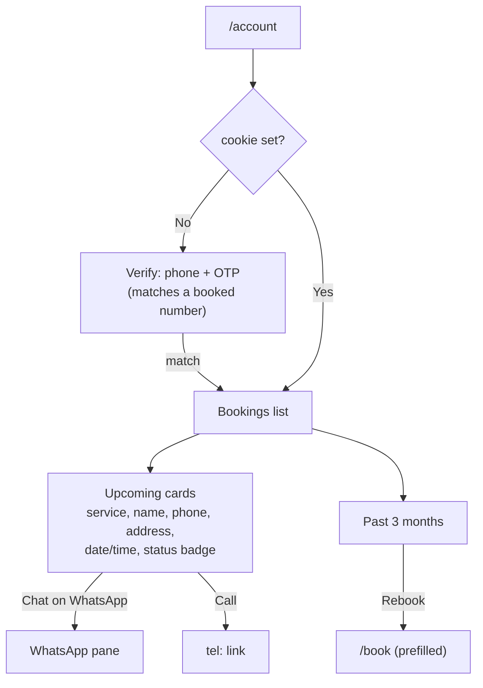

# KINE On-Demand — Customer Website Flow

Flow reference for the customer-facing site (`ondemand-app`). The app is a
single React SPA with three switchable surfaces — **Site** (this document),
**Panel** (ops), and **Trainer** — toggled by the dark DevBar at the top. Only
the Site is covered here.

- **Routing:** `HashRouter` (URLs look like `…/ondemand/#/physiotherapy`).
- **State:** one in-memory store (`store/store.tsx`), simulated clock
  (`store/clock.ts`), pure rules (`store/rules.ts`). No backend.
- **Auth model:** a "cookie" customer id (`cookieCustomerId`). A visitor is
  *logged out* until they complete phone → OTP → name, which creates/attaches a
  customer and sets the cookie.

---

## 1. Pages / routes

| Route | Screen | Purpose | Gated? |
|-------|--------|---------|--------|
| `/` | **Home** | Hero, choose service type, what-we-treat, FAQ | No |
| `/physiotherapy` | **Category** (physio) | Gate → login, or hub of conditions | Yes* |
| `/physical-training` | **Category** (training) | Gate → login, or hub of conditions | Yes* |
| `/:category/:condition` | **Occasion** | Ad-landing "brochure" for one condition | No (soft) |
| `/book` | **BookingFlow** | Full-screen stepped checkout | — |
| `/account` | **Account** | Your bookings (upcoming / past) | Yes (phone+OTP) |
| `/help` | **Help** | Support / WhatsApp | No |
| `/terms` | **Terms** | Legal | No |
| `/feedback/:token` | **Feedback** | Post-session feedback via link | Token |
| `*` | → `/` | Unknown routes redirect home | — |

\* *Gated = shows a login card when logged out; shows real content once logged in.*

Prices: **Physiotherapy ₹1,299**, **Physical Training ₹1,099** per home session.

---

## 2. Top-level navigation

---

## 3. First-time visitor (logged out)

The Category page is the gate. Logged out → login card over a brand banner.
Logging in creates the profile and reveals the condition hub.

**Login (LoginProfile) is a 2-step mini-flow**, reused by the gate, the Occasion
popup, and the booking `identity` step:

---

## 4. Ad-landing flow (Occasion / condition page)

Condition pages are the ad destinations — a decorated brochure (hero, symptoms,
benefits, FAQ, CTA). For logged-out traffic a **login popup fires after ~3s** to
capture the lead, but it's dismissible and never blocks reading or booking.

---

## 5. Booking flow (`/book`)

Full-screen stepped controller (outside the site chrome). The **`identity` step
only appears when logged out** — logged-in users skip straight to pay.

- Logged in: `address → when → review → pay`
- Logged out: `address → when → review → identity → pay`

Each step has a back arrow (disabled on `pay`); Review rows jump back to their
step for edits.

---

## 6. Session lifecycle

A placed booking moves through these statuses (driven by the Panel/Trainer
surfaces and the rules engine). The customer sees the current status on their
Account cards.

---

## 7. Account ("Your bookings")

Each card carries **Chat on WhatsApp** and **Call**; past cards also offer
**Rebook**, which re-enters `/book` prefilled with that session's
service/condition/type.

---

## 8. Notes & conventions

- **Desktop is zoomed to 50%** (`.site-zoom { zoom: .5 }` at `lg`) so the whole
  customer site reads like a browser zoom-out; mobile is untouched.
- **26px** is the minimum desktop font size; **no grey** (black/white + brand
  green/blue/orange only); pure white background with subtle grain texture.
- WhatsApp is the primary support channel throughout (gate, Occasion, booking
  confirmation, Account, Help).
- Everything is in-memory and resets on the DevBar **Reset**; no real payment,
  message, or booking is processed.
